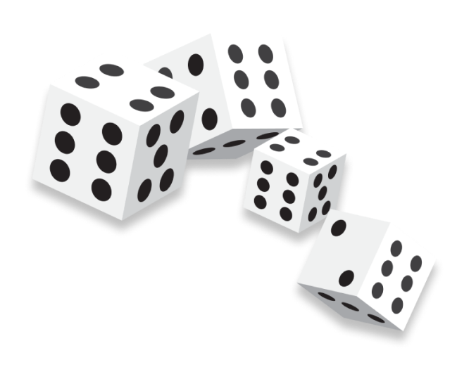

## Dice Game 🎲

A simple and fun dice game built with React and Vite.

## 🚀 How to Play

1. Click **Play Now** to start the game.
2. Select a number between **1 to 6**.
3. Click on the dice image to roll the dice.
4. If the number on the dice matches your selected number, you gain points equal to the dice value.
5. If the numbers do not match, **2 points** will be deducted from your total score.
6. Click **Reset Score** to reset your score to **0**.
7. Click **Show Rules** to see the game rules.

## 🛠️ Technologies Used

- React.js
- Vite
- JavaScript (ES6+)
- CSS


## 🏗️ Installation & Setup

### Prerequisites
Make sure you have **Node.js** installed.

### Steps to Run Locally

1. Clone the repository:
   ```sh
   git clone https://github.com/manjunathmj09/dice-game.git
   ```
2. Navigate into the project directory:
   ```sh
   cd dice-game
   ```
3. Install dependencies:
   ```sh
   npm install
   ```
4. Start the development server:
   ```sh
   npm run dev
   ```
5. Open [http://localhost:5173](http://localhost:5173) in your browser.

## 🌍 Deployment
This project is deployed using **GitHub Pages**.

To deploy manually:
```sh
npm run deploy
```
The deployed game can be accessed at: [Dice Game](https://manjunathmj09.github.io/dice-game/)

## 🎨 UI Preview


## 🤝 Contributing
Contributions, issues, and feature requests are welcome! Feel free to fork the repository and submit a pull request.

---
Enjoy playing the Dice Game! 🎲🔥

